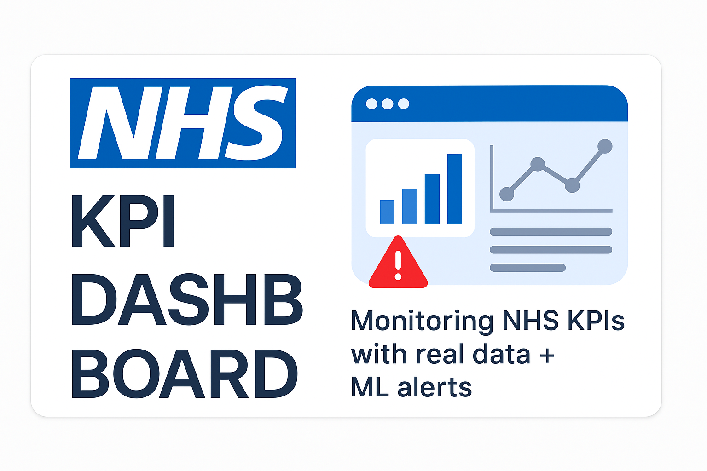

# NHS KPI Dashboard App



# 🏥 NHS KPI Dashboard (Streamlit Cloud Version)

An open-source, secure, cloud-friendly dashboard built with Streamlit to help visualize NHS Referral to Treatment (RTT) wait times using real data, track trends, and get smart alerts.

🔗 **Live App**: [https://nhs-kpi-dashboard.streamlit.app](https://nhs-kpi-dashboard.streamlit.app)  
🎥 **Loom Demo**: Coming soon

---

## 🔍 Overview

This NHS KPI Dashboard allows healthcare teams to:
- - 🔐 Staff login (demo users: `nhs_admin` / `doctor1`)
- 📈 Chart of estimated average weekly wait time
- ⚠️ ML-style alerts when wait times spike
- 📁 Upload ML prediction CSVs
- 📤 Export filtered data as CSV

Built with **Streamlit**, **Pandas**, and **Plotly**.

---


## 🔐 Demo Login

| Username     | Password     |
|--------------|--------------|
| `nhs_admin`  | `password123` |
| `doctor1`    | `welcome2025` |

> For demonstration only. For real-world use, implement NHS Login OAuth.

---
## 🗂 Data Source

The app uses NHS RTT data files from October 2024 (or any similar structured file) with weekly bins such as `Gt 01 To 02 Weeks SUM 1`, etc.

You can replace `data/rtt_oct2024_full.csv` with your own file.

## 📁 How to Run Locally


1. **Clone the repository**
   ```bash
   git clone https://github.com/tolaade23/nhs-kpi-dashboard.git
   cd nhs-kpi-dashboard-app
   ```

2. **Install dependencies**
   ```bash
   pip install -r requirements.txt
   ```

3. **Run the app**
   ```bash
   streamlit run app.py
   ```

---

## 🚀 Deployment

To deploy to [Streamlit Cloud](https://streamlit.io/cloud):
1. Upload this project to GitHub
2. Connect GitHub repo to Streamlit Cloud
3. Set `app.py` as the main file and add `requirements.txt`

---

## 🚀 One-click Deploy

[](https://share.streamlit.io)

> Tip: You’ll need to upload your real `rtt_oct2024_full.csv` into the `data/` folder after deployment.

---

## 📦 Folder Structure

```
├── app.py
└── data
    └── rtt_oct2024_full.csv
```

---

## ✅ Usage

```bash
streamlit run app.py
```

To use with your own RTT file:
- Replace `data/rtt_oct2024_full.csv` with your cleaned dataset.
- Ensure it contains `Period` and weekly SUM columns.

---

#Streamlit #NHS #Python #DataScience #MachineLearning #Op
## 👩‍💻 Built By

**Adetola Adeniyi** – [LinkedIn](https://www.linkedin.com/in/adetolaadeniyi/)  
Making data useful for smarter, fairer healthcare.


## 📊 Features

-
---

enData #AdetolaBuilds #HealthTech
